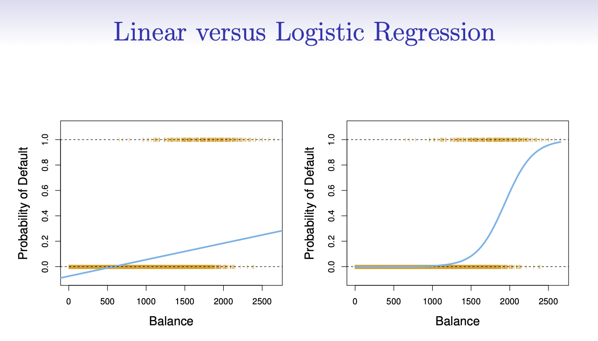
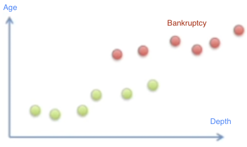
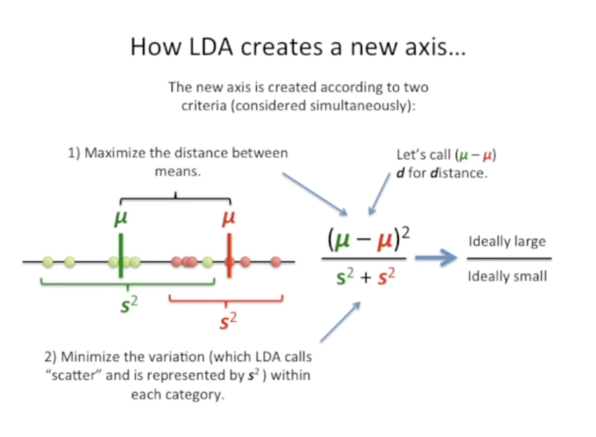
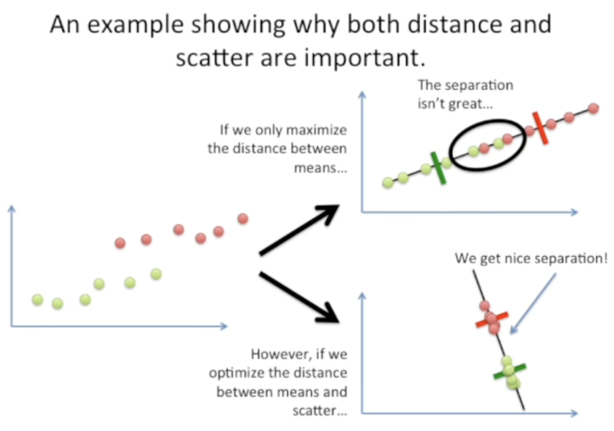
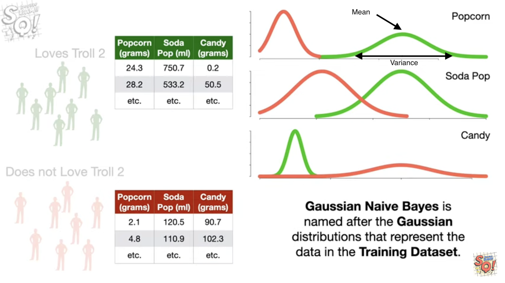
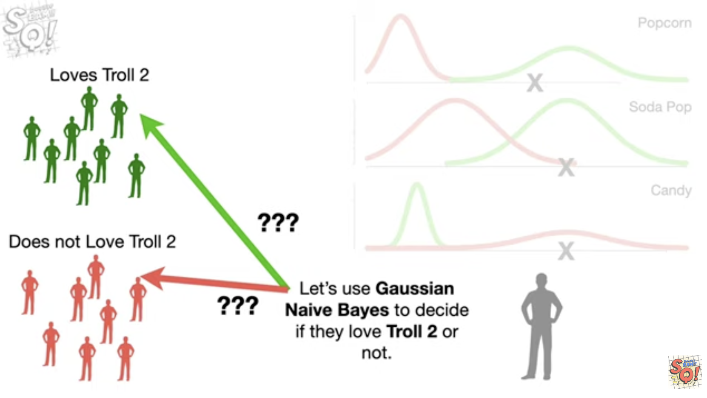
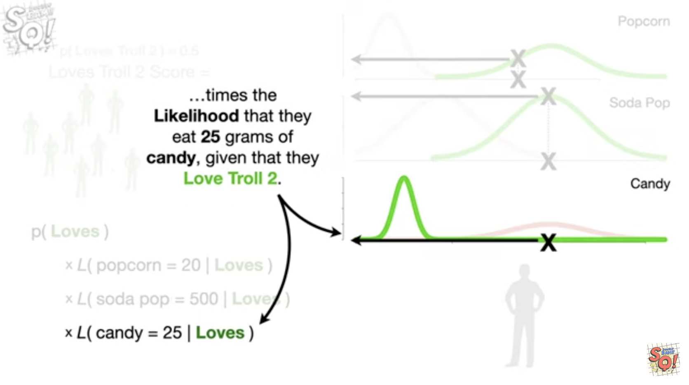
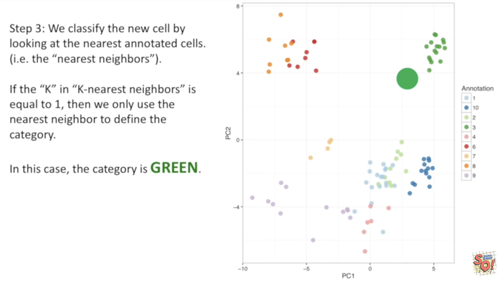
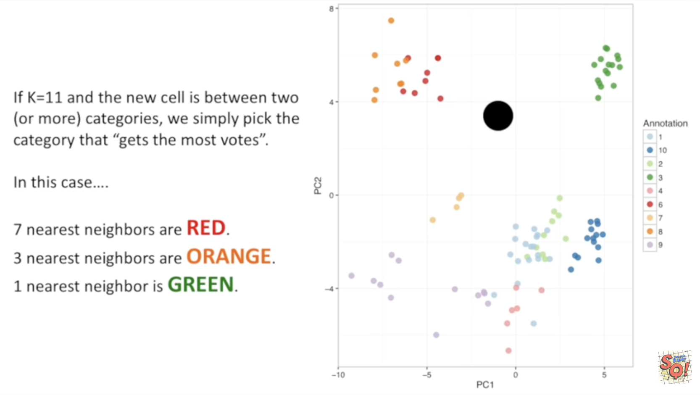

---
output:
  pdf_document: default
  html_document: default
---
# Classification

```{r, echo=FALSE}
set.seed(1234)
```

This session will be our first experience with *classification models*. These models differ from the regression model we saw in the last chapter by the fact that the *response variable is a qualitative variable* instead of a continuous variable.
This chapter will use [parsnip](https://www.tidymodels.org/start/models/) for model fitting and [recipes and workflows](https://www.tidymodels.org/start/recipes/) to perform the transformations.


{width=100%}

## The Stock Market Data

We load the tidymodels for modeling functions, ISLR and ISLR2 for data sets, [discrim](https://discrim.tidymodels.org/) to give us access to discriminant analysis models such as LDA and QDA as well as the Naive Bayes model and [poissonreg](https://poissonreg.tidymodels.org/) for Poisson Regression.

```{r, message=FALSE}
library(tidymodels)
library(ISLR) # For the Smarket data set
library(ISLR2) # For the Bikeshare data set
library(discrim)
library(poissonreg)
library(klaR) # For Naive Bayes
library(funModeling) 
library(GGally)
```

Set up workspace, i.e., remove all existing data from working memory, initialize the random number generator, turn of scientific notation of large numbers,....

```{r, echo=FALSE}
rm(list=ls())
set.seed(1234)
options(scipen=10000)
select <- dplyr::select
```

We will be examining the `Smarket` data set for this lab. It contains a number of numeric variables plus a variable called `Direction` which has the two labels `"Up"` and `"Down"`. Before we do on to modeling, let us take a look at the correlation between the variables.

```{r}
data(Smarket)
head(Smarket)
??Smarket
```


Let's do an exploratory data analysis first.

```{r}
basic_eda <- function(data)
{
  glimpse(data)
  print(status(data))
  freq(data) 
  print(profiling_num(data))
  plot_num(data)
  describe(data)
}

basic_eda( Smarket )
```

Check the correlation.

```{r}
Smarket %>%
  ggpairs()
```

And we see that these *variables are more or less uncorrelated* with each other. The other pair is `Year` and `Volume` that is a little correlated.

If you want to create heatmap styled correlation chart...

```{r}
Smarket %>%
  ggcorr( method = c("pairwise", "pearson"),
  nbreaks = NULL, digits = 2, geom = "tile", 
  label = T, label_alpha = F, label_size = 3, label_round = 2)
```

We see a correlation between `Year` against `Volume`. If we plot `Year` against `Volume` we see that there is an upwards trend in `Volume` with time.

```{r}
ggplot(Smarket, aes(Year, Volume)) +
  geom_jitter(height = 0)
```

## Logistic Regression


The probability could be modeled as:

$$ p(X) = \beta_0 + \beta_1 X $$
... but is does not fit the data well (e.g., predicts values below zero). We need a link function that constrains it between 0 and 1:

$$ p(X) = \frac{e^{\beta_0 + \beta_1X}}{1 + e^{\beta_0 + \beta_1 X}}. $$
The odds is found by re-arranging the logistic function:

$$ \text{Odds} = \frac{p(X)}{1 - p(X)} = e^{\beta_0 + \beta_1 X}. $$
This can take any value between 0 (p(X)=0) and ∞ (p(X)=1). Basic interpretation:

- A probability of 0.2 gives 1:4 odds.
- A probability of 0.9 gives 9:1 odds.

Taking the logarithm of both sides gives us the log odds or logit which is linear in X:

$$ \log \left(\frac{p(X)}{1 - p(X)}\right) = \beta_0 + \beta_1 X.$$


Now we will fit a *logistic regression model*. We will again use the parsnip package, and we will use `logistic_reg()` to create a logistic regression *model specification*.

```{r}
lr_spec <- logistic_reg() %>%
  set_mode("classification") %>%
  set_engine("glm")
```

Notice that while I did set the engine and mode, they are just restating the defaults.

We can now fit the model like normal. We want to *model the `Direction` of the stock market (Y) based on the percentage return from the 5 previous days plus the volume of shares traded (X1 to X6)*.

When fitting a classification with parsnip requires that the *response variable is a factor*. This is the case for the `Smarket` data set so we don't need to do adjustments.

```{r}
head(Smarket)

lr_fit <- lr_spec %>%
  fit(
    Direction ~ Lag1 + Lag2 + Lag3 + Lag4 + Lag5 + Volume,
    data = Smarket
    )

lr_fit
```

this fit is done using the `glm()` function, and it comes with a very handy `summary()` method as well.

```{r}
lr_fit %>%
  pluck("fit") %>%
  summary()
```

This lets us see a couple of different things such as: 
- parameter estimates (log-odds!!), 
- standard errors, 
- p-values, and 
- model fit statistics. 

We can use the `tidy()` function to extract some of these model attributes for further analysis or presentation.
 
```{r}
tidy(lr_fit)
```

Predictions are done much the same way. Here we use the model to predict on the data it was trained on.

```{r}
predict(lr_fit, new_data = Smarket)
```

The result is a tibble with a single column `.pred_class` which will be a factor variable of the same labels as the original training data set.

We can also get back *probability predictions*, by specifying `type = "prob"`.

```{r}
predict(lr_fit, new_data = Smarket, type = "prob")
```

note that we get back a *column for each of the classes*. This is a little reductive since we could easily calculate the inverse, but once we get to multi-classification models it becomes quite handy.

Using `augment()` we can *add the predictions to the data.frame* and then use that to look at model performance metrics. before we calculate the metrics directly, I find it useful to look at the [confusion matrix](https://en.wikipedia.org/wiki/Confusion_matrix). This will show you how well your predictive model is performing by given a table of predicted values against the true value.

```{r}
augment(lr_fit, new_data = Smarket)

augment(lr_fit, new_data = Smarket) %>%
  conf_mat(truth = Direction, estimate = .pred_class)
```

A good performing model would ideally have *high numbers along the diagonal* (up-left to down-right) with small numbers on the off-diagonal. We see here that the model isn't great, as it tends to predict `"Down"` as `"Up"` more often than it should.

if you want a more visual representation of the confusion matrix you can pipe the result of `conf_mat()` into `autoplot()` to generate a ggplot2 chart.

```{r}
augment(lr_fit, new_data = Smarket) %>%
  conf_mat(truth = Direction, estimate = .pred_class) %>%
  autoplot(type = "heatmap")
```

We can also *calculate various performance metrics*. One of the most *common metrics is accuracy*, which is how often the model predicted correctly as a percentage.

```{r}
augment(lr_fit, new_data = Smarket) %>%
  accuracy(truth = Direction, estimate = .pred_class)
```

and we see that the *accuracy isn't great* either which is obvious already looking at the confusion matrix.

We just fit a model and evaluated it on the same data. This doesn't give us that much information about the model performance. Let us instead *split up the data, train it on some of it and then evaluate it on the other part of the data*. Since we are working with some data that has a time component, it is natural to fit the model using the first year's worth of data and evaluate it on the last year. This would more closely match how such a model would be used in real life.

```{r}
Smarket_train <- Smarket %>%
  filter(Year != 2005)

Smarket_test <- Smarket %>%
  filter(Year == 2005)
```

Now that we have split the data into `Smarket_train` and `Smarket_test` we can fit a logistic regression model to `Smarket_train` and evaluate it on `Smarket_test` to see how well the model generalizes.

```{r}
lr_fit2 <- lr_spec %>%
  fit(
    Direction ~ Lag1 + Lag2 + Lag3 + Lag4 + Lag5 + Volume,
    data = Smarket_train
    )
```

And we will evaluate on the testing data set.

```{r}
# Confusion Matrix
augment(lr_fit2, new_data = Smarket_test) %>%
  conf_mat(truth = Direction, estimate = .pred_class) 

# Accuracy
augment(lr_fit2, new_data = Smarket_test) %>%
  accuracy(truth = Direction, estimate = .pred_class) 
```

We see that this model is not more likely to predict `"Down"` rather than `"Up"`. Also, note how the *model performs worse than the last model*. This is expected since we are evaluating on new data.

We recall that the logistic regression model had underwhelming p-values. Let us see what happens if we *remove some of the variables that appear not to be helpful* we might achieve a more predictive model since the variables that do not have a relationship with the response will cause an increase in variance without a decrease in bias.

```{r}
# Fit model
lr_fit3 <- lr_spec %>%
  fit(
    Direction ~ Lag1 + Lag2,
    data = Smarket_train
    )

# Confusion matrix
augment(lr_fit3, new_data = Smarket_test) %>%
  conf_mat(truth = Direction, estimate = .pred_class) 

# Accuracy
augment(lr_fit3, new_data = Smarket_test) %>%
  accuracy(truth = Direction, estimate = .pred_class) 
```

And we see an *increase in performance*. The model is still not perfect but it is starting to perform better.

Suppose that we want to *predict the returns associated with particular values of `Lag1` and `Lag2`.* In particular, we want to predict `Direction` on a day when `Lag1` and `Lag2` equal 1.2 and 1.1, respectively, and on a day when they equal 1.5 and −0.8.

For this we start by creating a tibble corresponding to the scenarios we want to predict for

```{r}
Smarket_new <- tibble(
  Lag1 = c(1.2, 1.5), 
  Lag2 = c(1.1, -0.8)
)

head(Smarket_new)
```

And then we will use `predict()`

```{r}
predict(
  lr_fit3,
  new_data = Smarket_new, 
  type = "prob"
)
```

## Linear Discriminant Analysis

*Quick facts*
- LDA is used when groups/classes are known a priori (unlike in cluster analysis)
- LDA models the difference between the classes of data
- LDA expresses one dependent variable as a linear combination of other features or measurements
- LDA assumes that the independent variables are normally distributed
- LDA requires continuous independent variables

*Applications*
- Bankruptcy prediction
- Facial recognition

*How it works (simplified)*
Source: 1. https://youtu.be/azXCzI57Yfc

Let's assume we have the following data. We want to *classify bankruptcy* based on depth and age of a firm

{width=50%}

LDA reduces the two dimension by *mapping it on one axis*. How? (1) It maximizes the *distance between means* and (2) minimizes the *variation within each category* (in LDA called *"scatter"*).

{width=50%}

{width=50%}

*Further reading*
https://www.analyticsvidhya.com/blog/2021/08/a-brief-introduction-to-linear-discriminant-analysis/


Now we will perform LDA on the `Smarket` data. We will use the `discrim_linear()` function to create a LDA specification. We will continue to use 2 predictors for easy comparison.

```{r}
lda_spec <- discrim_linear() %>%
  set_mode("classification") %>%
  set_engine("MASS")

lda_fit <- lda_spec %>%
  fit(Direction ~ Lag1 + Lag2, data = Smarket_train)

lda_fit
```

One of the things to look for in the LDA output is the *group means*. We see that there is a slight difference between the means of the two groups. These suggest that *when the market increases (Up) there is a tendency for the previous 2 days' returns to be negative on days *, and *when the market declines (Down) there is a tendency for the previous day' returns to be positive on days.*

Predictions are done just the same as with logistic regression

```{r}
predict(lda_fit, new_data = Smarket_test)
predict(lda_fit, new_data = Smarket_test, type = "prob")
```

And we can take a look at the performance. 

```{r}
augment(lda_fit, new_data = Smarket_test) %>%
  conf_mat(truth = Direction, estimate = .pred_class) 

augment(lda_fit, new_data = Smarket_test) %>%
  accuracy(truth = Direction, estimate = .pred_class) 
```

And we see no markedly difference performance between this model and the logistic regression model.

## Quadratic Discriminant Analysis

*What's the difference to LDA?*
- LDA instead makes the additional simplifying homoscedasticity assumption (i.e. that the class covariances are identical)
- QDA allows class-specific covariance matrices.
- QDA accommodates more flexible decision boundaries compared to LDA, which also means that the number of parameters needed to be estimated also increases faster than that of LDA

We will now fit a QDA model. The `discrim_quad()` function is used here.

Once we have the model specification fitting the model is just like before.

```{r}
qda_spec <- discrim_quad() %>%
  set_mode("classification") %>%
  set_engine("MASS")

qda_fit <- qda_spec %>%
  fit(Direction ~ Lag1 + Lag2, data = Smarket_train)
```

```{r}
augment(qda_fit, new_data = Smarket_test) %>%
  conf_mat(truth = Direction, estimate = .pred_class) 

augment(qda_fit, new_data = Smarket_test) %>%
  accuracy(truth = Direction, estimate = .pred_class) 
```

And we are seeing another increase in accuracy. However this model still rarely predicts `"Down'`. This make it appear that the quadratic form assumed by QDA captures the relationship more clearly.

## Naive Bayes

Example: Assume we want to classify if people like the movie "Troll 2." As predictors we us popcorn, soda pop, and candy.

Core idea.

1) We create *Gaussian distribution for each predictor* in each class (we need mean and variance)

{width=50%}

2) We can use this distributions to *predict a person's class*

{width=50%}

3) We *multiply the likelihoods* for each predictor in each class (and the prior probability). We do that for both classes and compare the outcome. A higher likelyhood defines class membership.

{width=50%}

Further information (StatQuest videos):
- Naive Bayes for multinomial classes: https://youtu.be/H3EjCKtlVog
- Gaussian Naive Bayes: https://youtu.be/H3EjCKtlVog


We will now fit a Naive Bayes model to the `Smarket` data. For this, we will be using the `naive_Bayes()` function to create the specification and also set the `usekernel` argument to `FALSE`. This means that we are assuming that the predictors `Lag1` and `Lag2` are drawn from Gaussian distributions.

Once the model is specified, the fitting process is exactly like before

```{r}
nb_spec <- naive_Bayes() %>% 
  set_mode("classification") %>% 
  set_engine("klaR") %>% 
  set_args(usekernel = FALSE)  

nb_fit <- nb_spec %>% 
  fit(Direction ~ Lag1 + Lag2, data = Smarket_train)
```

Once the model is fit, we can create the confusion matrix based on the testing data and also assess the model accuracy.

```{r}
augment(nb_fit, new_data = Smarket_test) %>% 
  conf_mat(truth = Direction, estimate = .pred_class)
```

```{r}
augment(nb_fit, new_data = Smarket_test) %>% 
  accuracy(truth = Direction, estimate = .pred_class)
```

The accuracy of the Naive Bayes is very similar to that of the QDA model. This seems reasonable since the below scatter plot shows that there is no apparent relationship between `Lag1` vs `Lag2` and thus the Naive Bayes' assumption of independently distributed predictors is reasonable.

```{r}
ggplot(Smarket, aes(Lag1, Lag2)) +
  geom_point(alpha = 0.1, size = 2) +
  geom_smooth(method = "lm", se = FALSE) +
  labs(title = "No apparent correlation between Lag1 and Lag2")
```

## K-Nearest Neighbors

Core idea:

1) We first need classes. We assume they are already there (we discuss clustering later)
2) We classify a new instance based in its K nearest neighbors

Example with K=1

{width=50%}

Example with K=11

{width=50%}

Further information (StatQuest videos): https://youtu.be/HVXime0nQeI

Let us take a look at a *K-Nearest Neighbors model*. Here, we have to *specify hyperparameters*. I have set it to 3 with `neighbors = 3`. Fitting is done like normal.

```{r}
knn_spec <- nearest_neighbor(neighbors = 3) %>%
  set_mode("classification") %>%
  set_engine("kknn")

knn_fit <- knn_spec %>%
  fit(Direction ~ Lag1 + Lag2, data = Smarket_train)

knn_fit
```

And evaluation is done the same way

```{r}
augment(knn_fit, new_data = Smarket_test) %>%
  conf_mat(truth = Direction, estimate = .pred_class) 

augment(knn_fit, new_data = Smarket_test) %>%
  accuracy(truth = Direction, estimate = .pred_class) 
```

It appears that this *model is not performing that well.*

We will try using a *K-nearest neighbors model in an application to caravan insurance data.* This data set includes 85 predictors that measure demographic characteristics for 5822 individuals. The *response variable is `Purchase`, which indicates whether or not a given individual purchases a caravan insurance policy.* In this data set, only 6% of people purchased caravan insurance.

```{r}
head(Caravan)
??Caravan
```


We want to build a *predictive model that uses the demographic characteristics* to predict whether an individual is going to purchase a caravan insurance. Before we go on, we split the data set into a *training data set and testing data set*. (This is a not the proper way this should be done. See next chapter for the correct way.)

```{r}
Caravan_test <- Caravan[seq_len(1000), ]
Caravan_train <- Caravan[-seq_len(1000), ]
```

Since we are using a K-nearest neighbor model, *it is importance that the variables are centered and scaled* to make sure that the variables have a uniform influence. We can accomplish this transformation with `step_normalize()`, which does centering and scaling in one go.

```{r}
rec_spec <- recipe(Purchase ~ ., data = Caravan_train) %>%
  step_normalize(all_numeric_predictors())
```

We will be *trying different values of K* to see how the number of neighbors affect the model performance. A workflow object is created, with just the recipe added.

```{r}
Caravan_wf <- workflow() %>%
  add_recipe(rec_spec)
```

Next we create a general KNN model specification.

```{r}
knn_spec <- nearest_neighbor() %>%
  set_mode("classification") %>%
  set_engine("kknn")
```

We can then use this model specification along with `Caravan_wf` to create 3 full workflow objects for `K = 1,3,5`.

```{r}
knn1_wf <- Caravan_wf %>%
  add_model(knn_spec %>% set_args(neighbors = 1))

knn3_wf <- Caravan_wf %>%
  add_model(knn_spec %>% set_args(neighbors = 3))

knn5_wf <- Caravan_wf %>%
  add_model(knn_spec %>% set_args(neighbors = 5))
```

With all these workflow specification we can fit all the models one by one.

```{r}
knn1_fit <- fit(knn1_wf, data = Caravan_train)
knn3_fit <- fit(knn3_wf, data = Caravan_train)
knn5_fit <- fit(knn5_wf, data = Caravan_train)
```

And we can calculate all the confusion matrices.

```{r}
augment(knn1_fit, new_data = Caravan_test) %>%
  conf_mat(truth = Purchase, estimate = .pred_class)
```

```{r}
augment(knn3_fit, new_data = Caravan_test) %>%
  conf_mat(truth = Purchase, estimate = .pred_class)
```

```{r}
augment(knn5_fit, new_data = Caravan_test) %>%
  conf_mat(truth = Purchase, estimate = .pred_class)
```

And it appears that the model performance doesn't change much when changing from 1 to 5.

## Comparing multiple models

We have fitted a lot of different models in this session. And we were able to calculate the performance metrics one by one, but it is not ideal if we want to compare the different models. Below is an *example of how you can more conveniently calculate performance metrics for multiple models* at the same time.

Start of by creating a named *list of the fitted models you want to evaluate*. I have made sure only to include models that were fitted on the same parameters to make it easier to compare them.

```{r}
models <- list("Logistic regression" = lr_fit3,
               "LDA" = lda_fit,
               "QDA" = qda_fit,
               "NB" = nb_fit,
               "KNN" = knn_fit)
```

Next use `imap_dfr()` from the [purrr](https://purrr.tidyverse.org/) package to apply `augment()` to each of the models using the testing data set. `.id = "model"` creates a column named `"model"` that is added to the resulting tibble using the names of `models`.

```{r}
preds <- imap_dfr(models, augment, 
                  new_data = Smarket_test, .id = "model")

preds %>%
  select(model, Direction, .pred_class, .pred_Down, .pred_Up)
```

we have seen how to use `accuracy()` a lot of times by now, but it is not the only metric to use for classification, and *yardstick* provides [many more](https://yardstick.tidymodels.org/reference/index.html#section-classification-metrics).
You can combine multiple different metrics together with `metric_set()`

```{r}
multi_metric <- metric_set(accuracy, sensitivity, specificity)
```

and then the *resulting function can be applied to calculate multiple metrics at the same time*. All of the yardstick works with grouped tibbles so by calling `group_by(model)` we can calculate the metrics *for each of the models in one go*.

```{r}
preds %>%
  group_by(model) %>%
  multi_metric(truth = Direction, estimate = .pred_class)
```

The same technique can be used to create ROC curves.

```{r}
preds %>%
  group_by(model) %>%
  roc_curve(Direction, .pred_Down) %>%
  autoplot()
```

Here you can't see the LDA because it lies perfectly under the logistic regression.
