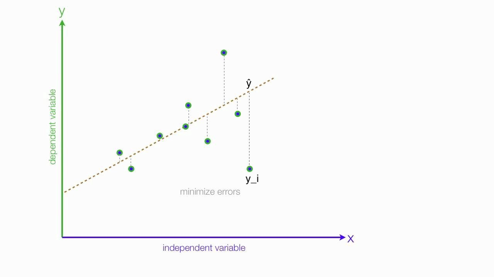
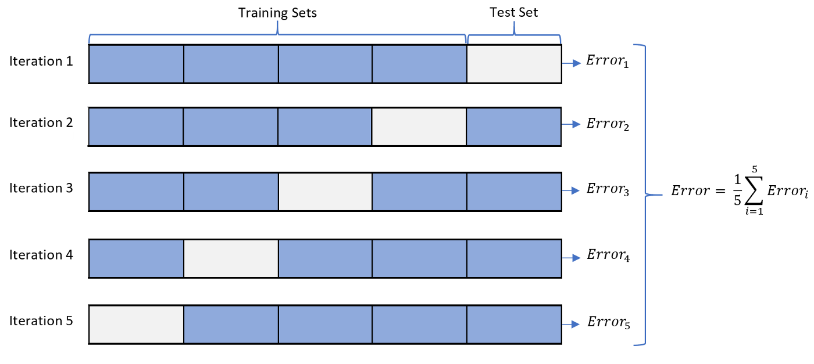
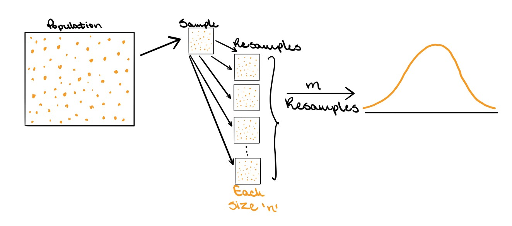

# Resampling Methods

```{r, echo=FALSE}
set.seed(1234)
```

This session will show us how to perform *different resampling techniques*. Some of these tasks are quite general and useful in many different areas. The bootstrap being such an example. This chapter introduces a lot of new packages.

This chapter will bring [rsample](https://www.tidymodels.org/start/resampling/) into view for creating resampled data frames as well as [yardstick](https://yardstick.tidymodels.org/) to calculate performance metrics. 

Lastly, will we also use [tune](https://tune.tidymodels.org/) to fit out models within said resamples. We also see a use of [dials](https://dials.tidymodels.org/) which are used together with tune to select hyperparameter tuning values.

```{r, message=FALSE}
library(tidymodels)
library(ISLR)

# Save datasets
Auto <- tibble(Auto)
Portfolio <- tibble(Portfolio)

?ISLR::Portfolio
?ISLR::Auto
```

## Error Metrics

**What's RMSE?**
In regression models we often want to minimize prediction errors. Often, we use RMSE (root mean squared error) but what is it? 

(Source: https://medium.com/analytics-vidhya/mae-mse-rmse-coefficient-of-determination-adjusted-r-squared-which-metric-is-better-cd0326a5697e)

{width=60%}

**Mean Absolute Error (MAE)** 
It represents the *average of the absolute difference between the actual and predicted values* in the dataset. It measures the average of the residuals in the dataset.

$$\text{MAE}=\frac{1}{n} \cdot \sum_{i = 1}^n |y_i - \hat{y}|$$

**Mean Squared Error (MSE)**
It represents the average of the squared difference between the original and predicted values in the data set. It measures the variance of the residuals.

$$\text{MSE}=\frac{1}{n} \cdot \sum_{i = 1}^n (y - \hat{y})^2$$

**Root Mean Squared Error (RMSE**
It is the square root of Mean Squared error. It measures the standard deviation of residuals.

$$\text{RMSE}=\sqrt{\text{MSE}}$$
When assessing how well a model fits a dataset, *we use the RMSE more often* because it is measured in the same units as the response variable.


## The Validation Set Approach

**Problem description:** 
So far we used all data for training. But *which data should we use for testing?* 
*Solution*: we split all data in to *training* and *testing*. But how do we pick the best points for training and testing. Cross Validation uses all points for both in an iterative way.

{width=100%}

**Why?**
When fitting a model it is often desired to be able to calculate a performance metric to *quantify how well the model fits the data*. If a model is evaluated on the data it was fit on you are quite likely to get over-optimistic results.

**How?**
Splitting of the data is done using **random sampling**, so it is advised to **set a seed** before splitting to assure we can reproduce the results.

The `initial_split()` function takes a data.frame and returns a `rsplit` object. This object contains information about which observations belong to which data set, testing, and training. This is where you would normally **set a proportion of data that is used for training** and how much is used for evaluation. This is set using the `prop` argument which I set to `0.5` to closely match what happened in ISLR. I'm also setting the `strata` argument. This argument makes sure that both sides of the split have roughly the same distribution for each value of `strata`. If a numeric variable is passed to `strata` then it is binned and distributions are matched within bins.


```{r}
set.seed(1)
Auto_split <- initial_split(Auto, strata = mpg, prop = 0.5)
Auto_split
```

The **testing and training data sets** can be materialized using the `testing()` and `training()` functions respectively.

```{r}
Auto_train <- training(Auto_split)
Auto_test <- testing(Auto_split)
```

And by looking at `Auto_train` and `Auto_test` we see that the lengths match what we expect.

```{r}
Auto_train
Auto_test
```

Now that we have a train-test split let us *fit some models and evaluate their performance*. 

Before we move on it is important to reiterate that you should only *use the testing data set once!* Once you have looked at the performance on the testing data set you should not modify your models. If you do you might overfit the model due to data leakage.

Our modeling goal is to *predict `mpg` by `horsepower` using a simple linear regression* model, *and a polynomial regression model.* 

First, we set up a linear regression specification.

```{r}
lm_spec <- linear_reg() %>%
  set_mode("regression") %>%
  set_engine("lm")
```

And we fit it like normal. Note that we are fitting it using `Auto_train`.

```{r}
lm_fit <- lm_spec %>% 
  fit(mpg ~ horsepower, data = Auto_train)
```

Plot the regression with the training data.

```{r}
lmfit <- lm(mpg ~ horsepower, data = Auto_train)
summary(lmfit)

# Plot
ggplot(Auto_train, aes(horsepower, mpg)) +
    geom_point() +
    geom_line(aes(y = predict(lmfit)))
```

We can now use the `augment()` function to *extract the prediction* and `rmse()` to calculate the *root mean squared error*. This will be the testing RMSE since we are evaluating on `Auto_test`.

```{r}
augment(lm_fit, new_data = Auto_test) %>%
  rmse(truth = mpg, estimate = .pred)
```

and we get a **RMSE** of `r augment(lm_fit, new_data = Auto_test) %>% rmse(truth = mpg, estimate = .pred) %>% pull(.estimate)`. This particular value *is going to vary depending on what seed number you picked* since the random sampling used in splitting the data set will be slightly different.

Using this framework makes it easy for us to calculate the *training RMSE*

```{r}
augment(lm_fit, new_data = Auto_train) %>%
  rmse(truth = mpg, estimate = .pred)
```

Comparing these two values can give us **a look into how generalizable the model is to data it hasn't seen before**. We do expect that the training RMSE to be lower than the testing RMSE but **if you see a large difference there is an indication of overfitting** or a shift between the training data set and testing data set. We don't expect a shift here since the data sets were created with random sampling.

**Polynomial Model**

Next we will fit a **polynomial regression model**. We can use the linear model specification `lm_spec` to add a preprocessing unit with `recipe()` and `step_poly()` to create the polynomial expansion of `horsepower`. we can combine these two with `workflow()` to create a workflow object.

```{r}
# Recipe
poly_rec <- recipe(mpg ~ horsepower, data = Auto_train) %>%
  step_poly(horsepower, degree = 2)

# Workflow
poly_wf <- workflow() %>%
  add_recipe(poly_rec) %>%
  add_model(lm_spec)

poly_wf
```

We can now fit this model. Again remember to fit it on the training data set `Auto_train`.

```{r}
poly_fit <- fit(poly_wf, data = Auto_train)
tidy(poly_fit)
```

Plot the model.

```{r}
polyfit <- lm(mpg ~ horsepower + I(horsepower^2), data = Auto_train)
summary(polyfit)

# Plot
ggplot(Auto_train, aes(horsepower, mpg)) +
    geom_point() +
    geom_line(aes(y = predict(polyfit)))
```

The testing RMSE is then calculated as

```{r}
augment(poly_fit, new_data = Auto_test) %>%
  rmse(truth = mpg, estimate = .pred)
```

Which is *a little bit lower*. So it would appear just from this, that the *polynomial regression model has a better fit*. Note that we are making decisions using the testing performance metrics, not the training performance metrics.

Lastly, we show below how *changing the seed* results in a slightly different estimate.

```{r}
set.seed(2)
Auto_split <- initial_split(Auto)

Auto_train <- training(Auto_split)
Auto_test <- testing(Auto_split)

poly_fit <- fit(poly_wf, data = Auto_train)

augment(poly_fit, new_data = Auto_test) %>%
  rmse(truth = mpg, estimate = .pred)
```

**Problem with 2-fold Cross Validation?**
We have only 2 folds. Though we randomly split the data we still may end up with a test set that differs heavily from the training set.

## k-Fold Cross-Validation

**Description:**
Here we use k=5 fold Cross Validation. We use 4/5 for training and 1/5 for testing.
We perform this procedure for all models at hand and compare the resulting error.

{width=100%}


Earlier we set `degree = 2` to create a second-degree *polynomial regression model*. But *suppose we want to find the best value of `degree` that yields the "closest" fit*. 

For example, this formula shows degree = 10.

$$ \text{mpg} = \beta_0 + \beta_1 \times \text{horsepower} + \beta_2 \times \text{horsepower}^2 + \beta_3 \times \text{horsepower}^3 + \beta_4 \times \text{horsepower}^4 + ... $$

This is known as *hyperparameter tuning* and it is a case where we can use k-Fold Cross-Validation. To use k-Fold Cross-Validation we will be using the `tune` package, and we need *3 things to get it working*:

1. A parsnip/*workflow object with one or more arguments marked for tuning*,
2. A `vfold_cv` rsample *object of the cross-validation resamples*,
3. A tibble denoting the *values of hyperparameter values to be explored* (called grid).

**1. Workflow Object**

We are doing the *hyperparameter tuning* on just one parameter, namely the *`degree` argument* in `step_poly()`. 
Creating a new recipe with `degree = tune()` indicated that we intend for `degree` to be tuned.

```{r}
poly_tuned_rec <- recipe(mpg ~ horsepower, data = Auto_train) %>%
  step_poly(horsepower, degree = tune())

summary(poly_tuned_rec)

poly_tuned_wf <- workflow() %>%
  add_recipe(poly_tuned_rec) %>%
  add_model(lm_spec)
```

As *the value of `degree` is unspecified* this means that we would *not be able to fit this workflow* right now, and if we try we get an error:

```{r, error=TRUE}
fit(poly_tuned_wf, data = Auto_train)
```

**2. Object of the Cross-Validation Resamples**

The next thing we need to create is the *k-Fold data set*. This can be done using the `vfold_cv()` function. Note that the function uses `v` instead of *k* which is the terminology of ISLR. we set `v = 10` as a common choice for *k*.

```{r}
Auto_folds <- vfold_cv(Auto_train, v = 10)
Auto_folds
```

The result is a tibble of `vfold_split`s which is quite similar to the `rsplit` object we saw earlier.

**3. Values of Hyperparameter Values to be Explored**

The last thing we need is a *tibble of possible values we want to explore*. Each of the tunable parameters in tidymodels has an associated function in the [dials package](https://dials.tidymodels.org/reference/index.html). We need to use the `degree()` function here, and we extend the range to have a max of 10. This dials function is then passed to `grid_regular()` to create a regular grid of values.


```{r}
degree_grid <- grid_regular(degree(range = c(1, 10)), levels = 10)
degree_grid
```

Using `grid_regular()` is a little overkill for this application since the following code would provide the same result. But once you have multiple parameters you want to tune it makes sure that everything is in check and properly named.

```{r}
degree_grid <- tibble(degree = seq(1, 10))
degree_grid
```

**Tuning**

Now that all the necessary objects have been created we can pass them to `tune_grid()` which will *fit the models within each fold for each value specified* in `degree_grid`.

```{r}
tune_res <- tune_grid(
  object = poly_tuned_wf, # workflow object
  resamples = Auto_folds, # CV resamples
  grid = degree_grid      # Possible values we want to explore
)

tune_res
```

It can be helpful to add `control = control_grid(verbose = TRUE)`, this will print out the progress. Especially helpful when the models take a while to fit. 

*`tune_res` by itself isn't easily readable*. Luckily `tune` provides a handful of *helper functions*.

`autoplot()` gives a *visual overview of the performance of different hyperparameter pairs.*

```{r}
autoplot(tune_res)
```

It appears that the *biggest jump in performance comes from going to `degree = 2`*. Afterward, there might be a little bit of improvement but it isn't as obvious (rsq = R2).

The *numbers* used for plotting *can be extracted directly with `collect_metrics()`*. We also get an estimate of the standard error of the performance metric. We get this since we have 10 different estimates, one for each fold.

```{r}
collect_metrics(tune_res)
```

You can also use `show_best()` to only *show the best performing models*.

```{r}
show_best(tune_res, metric = "rmse")
```

We did see that the performance plateaued after `degree = 2`. There are a couple of function to select models by more sophisticated rules. `select_by_one_std_err()` and `select_by_pct_loss()`.  *Here we use `select_by_one_std_err()` which selects the most simple model that is within one standard error of the numerically optimal results.* We need to specify `degree` to tell `select_by_one_std_err()` which direction is more simple.

You want to

- use `desc(you_model_parameter)` if larger values lead to a simpler model
- use `you_model_parameter` if smaller values lead to a simpler model

lower polynomials models are simpler so we ditch `desc()`.

```{r}
select_by_one_std_err(tune_res, degree, metric = "rmse")
```

This selected `degree = 2`. And we will use this value since we *simpler models sometimes can be very beneficial*. Especially if we want to explain what happens in it.

Here, we *save the model* into the best_degree object.

```{r}
best_degree <- select_by_one_std_err(tune_res, degree, metric = "rmse")
```

This selected value can be now be used to *specify the previous unspecified `degree` argument* in `poly_wf` using `finalize_workflow()`.

```{r}
final_wf <- finalize_workflow(poly_wf, best_degree)

final_wf
```

This workflow can now be fitted. And we want to make sure we fit it on the full training data set.

```{r}
final_fit <- fit(final_wf, Auto_train)

final_fit
```
Let's finally check the RMSE.

```{r}
augment(final_fit, new_data = Auto_test) %>%
  rmse(truth = mpg, estimate = .pred)
```

## Bootstrapping

*Learning objective:* Apply bootstrap resampling to estimate uncertainty in model parameters.

Bootstrapping consists of *randomly sampling a data set with replacement*, then performing the analysis individually on each bootstrapped replicate. 
The *variation in the resulting estimate is then a reasonable approximation of the variance in our estimate.*

{width=100%}

Source: https://towardsdatascience.com/bootstrapping-statistics-what-it-is-and-why-its-used-e2fa29577307

**Example**

Our modeling goal here is to *estimate how much sugar beer producers use relative to malt.* We’ll use bootstrap resampling to do this! 🍻

First, let’s look at the data on brewing materials.

```{r}
brewing_materials_raw <- read.csv("https://raw.githubusercontent.com/rfordatascience/tidytuesday/master/data/2020/2020-03-31/brewing_materials.csv")

brewing_materials_raw %>%
  count(type, wt = month_current, sort = TRUE)
```

How have some different brewing materials changed over time?

```{r}
# Data preparation
brewing_filtered <- brewing_materials_raw %>%
  filter(
    type %in% c(
      "Malt and malt products",
      "Sugar and syrups",
      "Hops (dry)"
    ),
    year < 2016,
    !(month == 12 & year %in% 2014:2015)
  ) %>%
  mutate(
    date = paste0(year, "-", month, "-01"),
    date = lubridate::ymd(date)
  )

# Plotting
brewing_filtered %>%
  ggplot(aes(date, month_current, color = type)) +
  geom_point()
```
There are strong *annual patterns* in these materials. We want to measure *how much sugar beer producers use relative to malt*.

```{r}
brewing_materials <- brewing_filtered %>%
  select(date, type, month_current) %>%
  pivot_wider(
    names_from = type,
    values_from = month_current
  ) %>%
  janitor::clean_names()

brewing_materials
```

Plot results.

```{r}
brewing_materials %>%
  ggplot(aes(malt_and_malt_products, sugar_and_syrups)) +
  geom_smooth(method = "lm") +
  geom_point()
```

There is a *lot of variation* in this relationship, but beer *reproducers use more sugar when they use more malt*. What is the relationship?

```{r}
beer_fit <- lm(sugar_and_syrups ~ 0 + malt_and_malt_products,
  data = brewing_materials
)

summary(beer_fit)
```

```{r}
tidy(beer_fit)
```

Here I am choosing to set the *intercept to zero* to take a simplified view of the malt-sugar relationship (i.e., beer producers don’t use any sugar if they aren’t starting with malt). 
We could leave that off and estimate both an intercept (baseline use of sugar all the time) and slope (increase in use of sugar per barrel of malt).

*This model and the visualization above are based on model assumptions that may not hold with our real-world beer production data.* 
Bootstrap resampling provides predictions and confidence intervals that are more robust.

**Bootstrap Resampling**

First, let’s create a set of bootstrap resamples.

```{r}
beer_boot <- bootstraps(brewing_materials, times = 1000, apparent = TRUE)
beer_boot
```
Next, let’s *train a model to each of these bootstrap resamples*. We can use tidy() with map() to create a dataframe of model results.

```{r}
beer_models <- beer_boot %>%
  mutate(
    model = map(splits, ~ lm(sugar_and_syrups ~ 0 + malt_and_malt_products, data = .)),
    coef_info = map(model, tidy)
  )

beer_coefs <- beer_models %>%
  unnest(coef_info)

beer_coefs
```
 **Evaluate Results**
 
 What is the distribution of the relationship between sugar and malt?

```{r}
beer_coefs %>%
  ggplot(aes(estimate)) +
  geom_histogram(alpha = 0.7, fill = "cyan3")
```

We can see *where this distribution is centered* and *how wide it is*. 
We can estimate these quantities using int_pctl() from the rsample package.

```{r}
int_pctl(beer_models, coef_info)
```

We can also *visualize some of these fits to the bootstrap resamples*. 
First, let’s use augment() to get the fitted values for each resampled data point.

```{r}
beer_aug <- beer_models %>%
  sample_n(200) %>%
  mutate(augmented = map(model, augment)) %>%
  unnest(augmented)

beer_aug
```

Then, let’s create a visualization.

```{r}
ggplot(beer_aug, aes(malt_and_malt_products, sugar_and_syrups)) +
  geom_line(aes(y = .fitted, group = id), alpha = .2, col = "cyan3") +
  geom_point()
```

