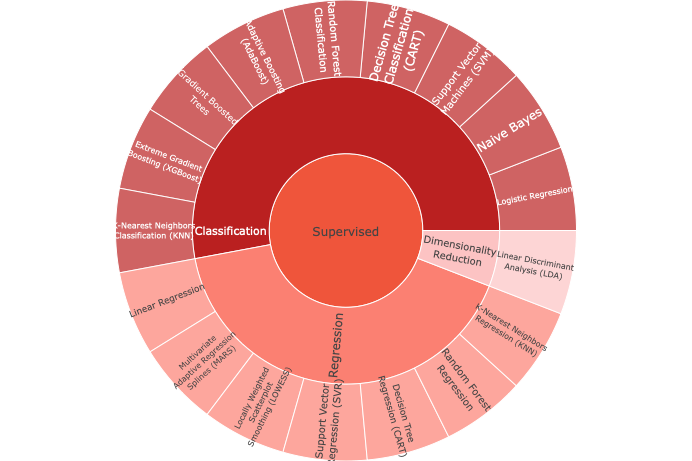
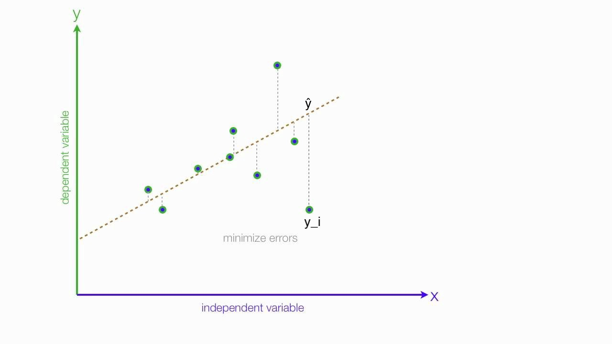
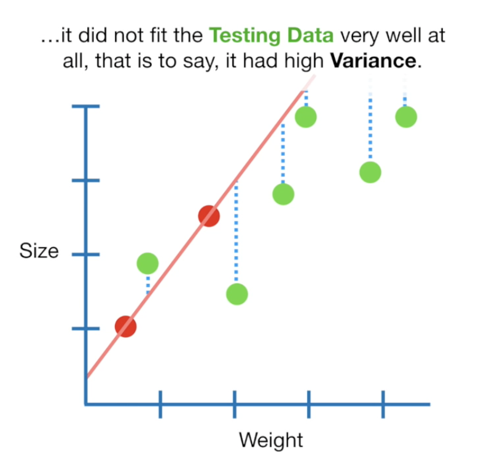
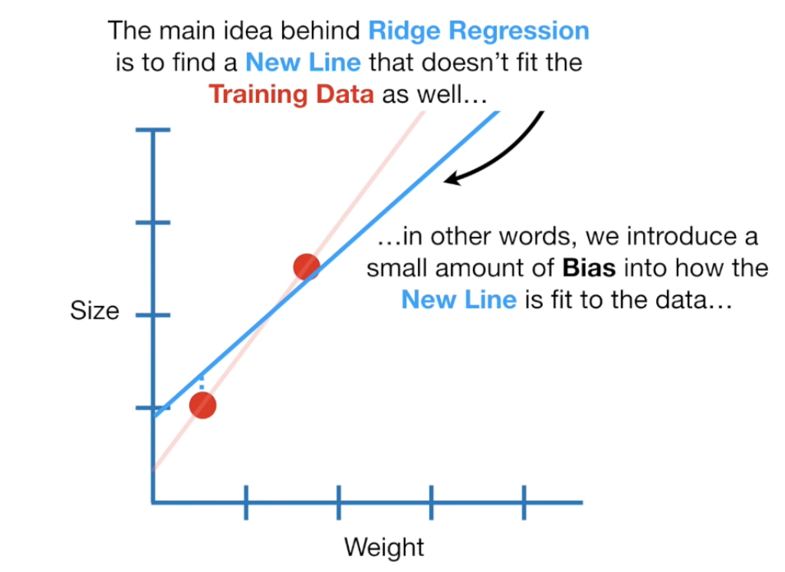
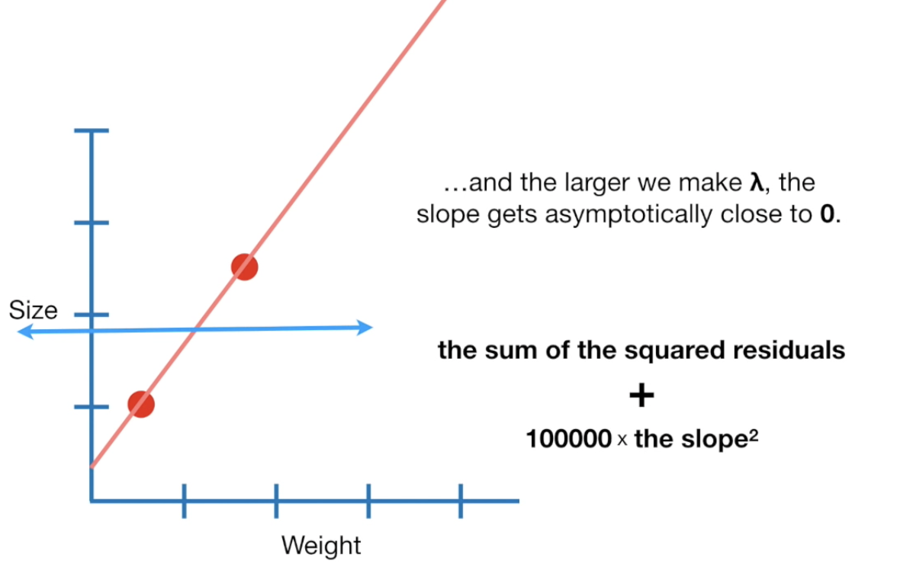
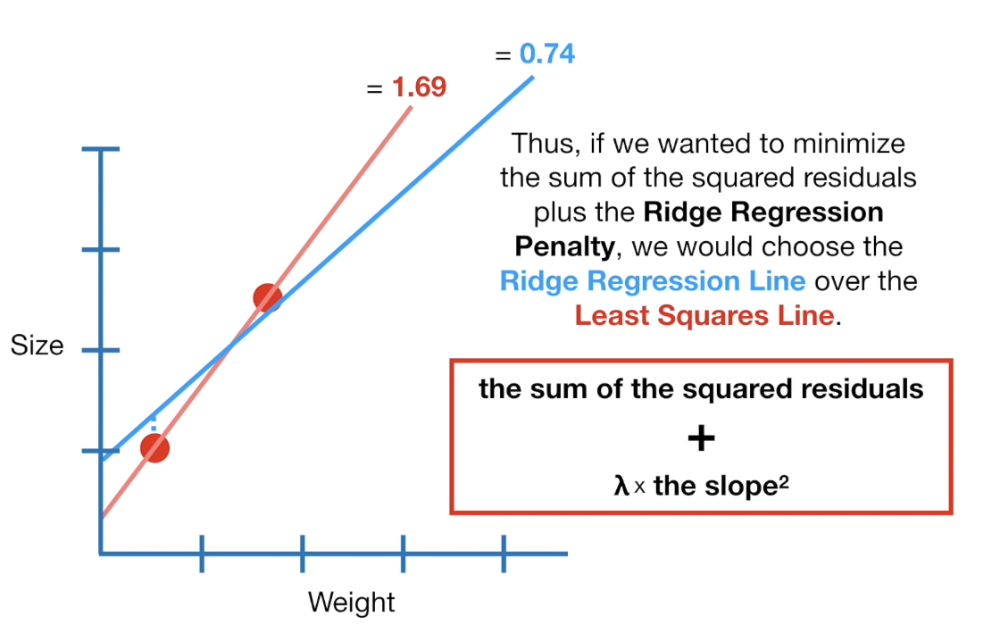

# Linear Model Selection and Regularization

```{r, echo=FALSE}
set.seed(1234)
```

This session will take a look at *regularization models and hyperparameter tuning*. 
These models are related to the models we saw in chapter 3 and 4, with the difference that they *contain a regularization term*.

{width="60%"} 

This chapter will use [parsnip](https://www.tidymodels.org/start/models/) for model fitting and [recipes and workflows](https://www.tidymodels.org/start/recipes/) to perform the transformations, and [tune and dials](https://www.tidymodels.org/start/tuning/) to tune the hyperparameters of the model.

```{r, message=FALSE}
library(tidymodels)
library(funModeling)
library(ISLR)
library(vip)
library(forcats)
library(GGally)
```

Set up workspace, i.e., remove all existing data from working memory,
initialize the random number generator, turn of scientific notation of
large numbers,....

```{r, echo=FALSE}
rm(list=ls())
set.seed(1234)
options(scipen=10000)
select <- dplyr::select
```

We wish to *predict the football players `marketvalue`* based on several different characteristics which are included in the data set. We will be using the a football player dataset from Müller et al. (2017).

Load data.

```{r}
d_player <- read.csv("players.csv") 


d_player <- read.csv("players.csv") %>%                                      # load data
  filter( season == "2014"  ) %>%                                            # filter for Season
  mutate( season = as.factor(season)) %>%
  select(-X, -name, -team, -competition, -season )

head( d_player )
```

> Question:
Why did I remove player name?

Let's do an exploratory data analysis first.

```{r}
basic_eda <- function(data)
{
  glimpse(data)
  print(status(data))
  freq(data) 
  print(profiling_num(data))
  plot_num(data)
  describe(data)
}

basic_eda( d_player )
```

> Question:
The values for Wikipedia, Google, and YouTube are log-transformed. How come the zero values for the Google data?

Check the correlations.

```{r}
d_player %>%
  ggpairs()
```


Let's split the data into training and testing.

```{r}
players_split <- initial_split(d_player, strata = "marketvalue")

players_train <- training(players_split)
players_test <- testing(players_split)
```

## Shrinkage Methods

-   Shrinkage methods constrain the coefficient estimates towards zero (shrinkage)
-   Shrinkage reduces the coefficients' variance

Recall that the *least squares* fitting procedure estimates β0,β1,...,βp
using the values that *minimize residual sum of squares (RSS)*:

{width="60%"} 

For a single predictor:

$$\text{RSS}=\sum_{i = 1}^n (y_i - \hat{y})^2$$

For a regression model with more predictors:

$$ \text{RSS} = \sum_{i=1}^n ( y_i - (\beta_0 + \sum_{j=1}^p \beta_j x_{ij}))^2$$

## Ridge Regression

**Core Idea**

Let's start with some example data, where *red = training* and *green = testing*. 
Here, the regression leads to *low bias* but *high variance*.

{width="40%"} 
*Ridge regression introduces a slight bias*, making the fit to the training data worse but the
prediction better (decrease variance!)

{width="50%"}

How? In ridge regression, *we introduce a shrinkage penalty*:

$$\text{RSS} + \lambda \sum_{j=1}^p \beta_j^2$$

Ridge regression *minizes RSS + lambda + slope^2*. What does it mean?

-   *slope^2* adds a penalty to traditional least squares method

-   *lambda* determines how severe the penalty is:

    -   if lambda = 0, we get the same as the least squares line
    -   if lambda is large, prediction becomes less sensitive
        (*shrinkage*!).

{width="60%"}

**Example**

*OLS*

Let's assume, we estimate y = b0 + b1 * x with the following values
(OLS):

size = 0.4 + 1.3 * weight

In OLS, RSS would be 0 (line overlaps data points).

With the ridge regression penalty, RSS would be

$$\text{RSS} + \lambda \sum_{j=1}^p \beta_j^2$$

That is: 0 + some lambda value + (1.3)^2. If lambda is 1: we get 0 + 1.69 = 1.69

*Ridge*

For the ridge regression, we would have this regression line (if lambda
= 1):

size = 0.9 + 0.8 * weight

Now, our regression line slightly deviates from the data points. 
RSS is now (0.3)^2 + (0.1)^2 = 0.09 + 0.01 = 0.1

If we add the penalty we get RSS + lambda + beta^2 = 0.1 + 1 + 0.64 = 0.74

{width="50%"}

When we increase lambda, the slope get's smaller. *Lambda is chosen via cross validation.*

Check Statquest for more information: <https://youtu.be/Q81RR3yKn30>

**Ridge Regression Implementation**

We will use the `glmnet` package to perform ridge regression. `parsnip` does not have a dedicated function to create a ridge regression model specification. You need to *use `linear_reg()`* and set `mixture = 0` to specify a ridge model. The *`mixture` argument specifies the amount of different types of regularization*, `mixture = 0` specifies only ridge regularization and `mixture = 1` specifies only lasso regularization.

Setting `mixture` to a value between 0 and 1 lets us use both. When using the `glmnet` engine we also need to *set a `penalty` (lambda) to be able to fit the model*. We will set this value to `0` for now, it is not the best value, but we will look at how to select the best value in a little bit.

```{r}
# Ridge regression (mixture =0)
ridge_spec <- linear_reg(mixture = 0, penalty = 0) %>%
  set_mode("regression") %>%
  set_engine("glmnet")
```

*Ridge regression is scale sensitive* so we need to make sure that the variables are on the same scale. We can use `step_normalize()`. 
Secondly let us deal with the factor variables ourself using `step_novel()` and `step_dummy()`.

```{r}
ridge_recipe <- 
  recipe(formula = marketvalue ~ ., data = players_train) %>% 
  step_novel(all_nominal_predictors()) %>%     # assigns a previously unseen factor level to a new value
  step_dummy(all_nominal_predictors()) %>% 
  step_zv(all_predictors()) %>%                # removes variables that contain only a single value
  step_normalize(all_predictors())

??step_novel
```

Now we combine to create a `workflow` object.

```{r}
ridge_workflow <- workflow() %>% 
  add_recipe(ridge_recipe) %>% 
  add_model(ridge_spec)
```

Once the specification is created we can fit it to our data. We will use
*all the predictors*.

```{r}
ridge_fit <- 
  ridge_workflow %>% fit(players_train)
ridge_fit
```

The `glmnet` package will fit the model for all values of `penalty` at
once, so let us see what the *parameter estimate for the model* is now
that we have `penalty = 0`.

```{r, message=FALSE}
tidy(ridge_fit)
```

Let us instead see what the estimates would be *if the penalty was 11498*.

```{r}
tidy(ridge_fit, penalty = 11498)
```

Notice how the *estimates are decreasing when the amount of penalty goes
up*. Look below at the parameter estimates for `penalty = 705` and
`penalty = 50`.

```{r}
tidy(ridge_fit, penalty = 50)
tidy(ridge_fit, penalty = 5000000)
```
> Question:
What happens if we increased the penalty to an extreme value, say, 5000000000?

We can visualize *how the magnitude of the coefficients are being regularized towards zero* as the penalty goes up.

```{r}
ridge_fit %>%
  extract_fit_engine() %>%
  plot(xvar = "lambda")
```

*Prediction is done like normal*, if we use `predict()` by itself, then
`penalty = 0` as we set in the model specification is used.

```{r}
predict(ridge_fit, new_data = players_test)
```

but we can also get *predictions for other values of `penalty`* by
specifying it in `predict()`

```{r}
predict(ridge_fit, new_data = players_test, penalty = 50)
```

> Question: what happens if we were to increase the penalty to an extreme value, say, 500000000000?

Check model performance.

```{r}
augment(ridge_fit, new_data = players_test) %>%
  select(marketvalue, .pred)

augment(ridge_fit, new_data = players_test) %>%
  rmse(truth = marketvalue, estimate = .pred)
```

**Hyperparameter Tuning**

We saw how we can fit a ridge model and make predictions for different values of `penalty`. 
But it would be nice if we could *find the "best" value of the penalty.*

This is something we can use *hyperparameter tuning* for. Hyperparameter tuning is in its simplest form a way of fitting many models with different sets of hyperparameters trying to find one that performs "best".

The complexity in hyperparameter tuning can come from how you try different models. 
We will keep it simple for this session and only look at grid search, only looking at evenly spaced parameter values.

This is a fine enough approach if you have one or two tunable parameters but can become computationally infeasible. 
See the chapter on [iterative search](https://www.tmwr.org/iterative-search.html) from [Tidy Modeling with R](https://www.tmwr.org/) for more information.

We can use the `tune_grid()` function to perform hyperparameter tuning using a grid search. 
`tune_grid()` *needs 3 different things*:

-   a *`workflow` object* containing the model and preprocessor,
-   a *`rset` object* containing the resamples the `workflow` should be
    fitted within, and
-   a tibble containing the *parameter values to be evaluated* (i.e., the grid).

**1. Create `workflow` object containing the model and preprocessor**

The model specification will look very similar to what we have seen
earlier, but *we will set `penalty = tune()`*. This tells `tune_grid()`
that the `penalty` parameter should be tuned.

```{r}
ridge_spec <- 
  linear_reg(mixture = 0, penalty = tune()) %>% 
  set_mode("regression") %>% 
  set_engine("glmnet")
```

Now we combine to create a `workflow` object.

```{r}
ridge_workflow <- workflow() %>% 
  add_recipe(ridge_recipe) %>% 
  add_model(ridge_spec)
```

**2. Create `rset` object containing the resamples the `workflow` should be fitted within**

We need to create is the *k-Fold data set*. This can be done using the
`vfold_cv()` function.

```{r}
players_fold <- vfold_cv(players_train, v = 10)
players_fold
```

**3. Create a tibble containing the parameter values to be evaluated**

*We need the values of `penalty` we are trying.* This can be created
using `grid_regular()` which creates a grid of evenly spaces parameter
values. We use the `penalty()` function from the
[dials](https://dials.tidymodels.org/) package to denote the parameter
and set the range of the grid we are searching for. Note that this
*range is log-scaled*.

```{r}
penalty_grid <- grid_regular(
  penalty(range = c(-5,5)), # penalty automatically uses log scale
  levels = 50)
penalty_grid
```

Using 50 levels for one parameter might seem overkill and in many
applications it is. But remember that `glmnet` fits all the models in
one go so adding more levels to `penalty` doesn't affect the
computational speed much.

**Tuning**

Now we have everything we need and we can fit all the models.

```{r}
tune_res <- tune_grid(
  ridge_workflow,
  resamples = players_fold, 
  grid = penalty_grid
)

tune_res
```

The output of `tune_grid()` can be hard to read by itself unprocessed.
`autoplot()` creates a great *visualization*

```{r}
autoplot(tune_res)
```

Here we see that *the amount of regularization affects the performance metrics differently*. 
Note how there are areas where the amount of regularization doesn't have any meaningful influence on the coefficient estimates.

We can also *see the raw metrics* that created this chart by calling
`collect_matrics()`.

```{r}
collect_metrics(tune_res)
```

The *"best" values* of this can be selected using `select_best()`, this
function requires you to specify a `matric` that it should select
against.

```{r}
best_penalty <- select_best(tune_res, metric = "rmse")
best_penalty
```

We see that indeed a value close to zero is the best penalty parameter.

This *value of `penalty` can then be used with `finalize_workflow()` to update/finalize the recipe* by replacing `tune()` with the value of `best_penalty`.

Now, this model should be fit again, this time using the whole training data set.

```{r}
ridge_final <- finalize_workflow(ridge_workflow, best_penalty)

ridge_final_fit <- fit(ridge_final, data = players_train)
```

This final model can now be applied on our testing data set to validate the performance.

```{r}
augment(ridge_final_fit, new_data = players_test) %>%
  rmse(truth = marketvalue, estimate = .pred)
```

Let's check the variable importance.

```{r}
ridge_final %>%
  fit(players_train) %>%
  extract_fit_parsnip() %>%
  vi(lambda = best_penalty$penalty) %>%
  mutate(
    Importance = abs(Importance),
    Variable = fct_reorder(Variable, Importance)
  ) %>%
  ggplot(aes(x = Importance, y = Variable, fill = Sign)) +
  geom_col() +
  scale_x_continuous(expand = c(0, 0)) +
  labs(y = NULL)
```

## The Lasso

**Core Idea**

Instead of squaring the slope (Ridge aka L2 norm), we take the absolute
value of it (Lasso aka L1 norm).

$$\text{RSS} + \lambda \sum_{j=1}^p |\beta_j|$$

*The big difference*: Ridge shrinks parameter asymptotically close to 0.
In Ridge, the penalty beta^2 is always slightly positive. Lasso can shrinks the slope fully to 0.

*Consequence*: In Lasso, some slope parameters drop out of the equation!

*Goal*: find a perfect size of lambda. This is done via Cross Validation

Check StatQuest: <https://youtu.be/NGf0voTMlcs>

**Lasso Regression Implementation**

We will use the `glmnet` package to perform lasso regression. `parsnip`
does not have a dedicated function to create a ridge regression model
specification. You need to *use `linear_reg()` and set `mixture = 1`* to
specify a lasso model. The `mixture` argument specifies the amount of
different types of regularization, `mixture = 0` specifies only ridge
regularization and `mixture = 1` specifies only lasso regularization.
Setting `mixture` to a value between 0 and 1 lets us use both.

The following procedure will be very similar to what we saw in the ridge
regression section. The preprocessing needed is the same, but let us
write it out one more time.

```{r}
lasso_recipe <- 
  recipe(formula = marketvalue ~ ., data = players_train) %>% 
  step_novel(all_nominal_predictors()) %>% 
  step_dummy(all_nominal_predictors()) %>% 
  step_zv(all_predictors()) %>% 
  step_normalize(all_predictors())
```

Next, we finish the lasso regression `workflow`.

```{r}
lasso_spec <- 
  linear_reg(mixture = 1, penalty = tune()) %>% 
  set_mode("regression") %>% 
  set_engine("glmnet") 

lasso_workflow <- workflow() %>% 
  add_recipe(lasso_recipe) %>% 
  add_model(lasso_spec)
```

While we are doing a different kind of regularization we still use the
same `penalty` argument. I have picked a different range for the values
of penalty since I know it will be a good range. You would in practice
have to cast a wide net at first and then narrow on the range of
interest.

```{r}
penalty_grid <- grid_regular(
  penalty(range = c(-5,5)), 
  levels = 50)
```

And we can use `tune_grid()` again.

Further information: <https://github.com/tidymodels/parsnip/issues/282>

```{r}
tune_res <- tune_grid(
  lasso_workflow,
  resamples = players_fold, 
  grid = penalty_grid
)

autoplot(tune_res)
```

We select the best value of `penalty` using `select_best()`

```{r}
best_penalty <- select_best(tune_res, metric = "rmse")
best_penalty
```

And refit the using the whole training data set.

```{r}
lasso_final <- finalize_workflow(lasso_workflow, best_penalty)

lasso_final_fit <- fit(lasso_final, data = players_train)
```

And we are done, by calculating the \`rmse\`\` value for the lasso model
can we see that for this data it doesn't make much difference which kind
of regularization we use as they have similar performance.

```{r}
augment(ridge_final_fit, new_data = players_test) %>%
  rmse(truth = marketvalue, estimate = .pred)
```

Let's check the variable importance.

```{r}
lasso_final %>%
  fit(players_train) %>%
  extract_fit_parsnip() %>%
  vi(lambda = best_penalty$penalty) %>%
  mutate(
    Importance = abs(Importance),
    Variable = fct_reorder(Variable, Importance)
  ) %>%
  ggplot(aes(x = Importance, y = Variable, fill = Sign)) +
  geom_col() +
  scale_x_continuous(expand = c(0, 0)) +
  labs(y = NULL)
```
