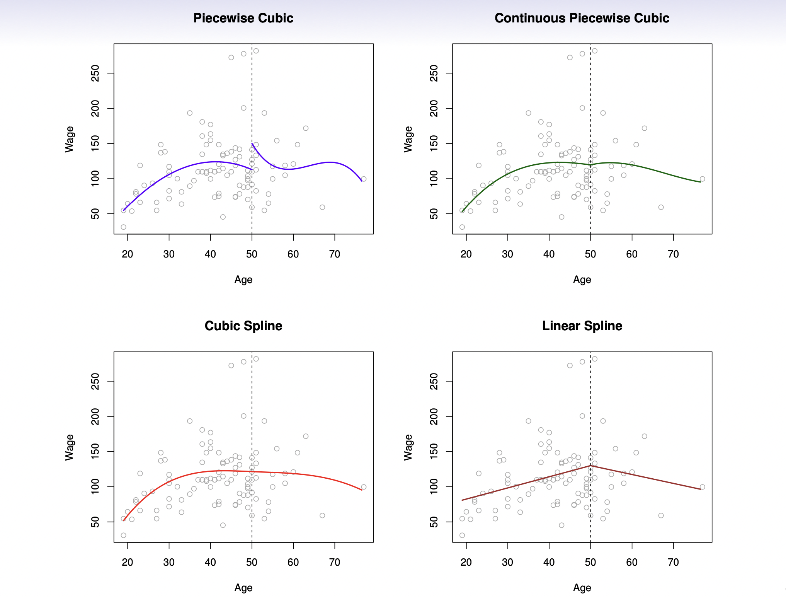

# Moving Beyond Linearity

This session will look at the various ways we can introduce non-linearity into our model by doing preprocessing. Methods include: polynomials expansion, step functions, and splines.

This chapter will use [parsnip](https://www.tidymodels.org/start/models/) for model fitting and [recipes and workflows](https://www.tidymodels.org/start/recipes/) to perform the transformations.

```{r, message=FALSE}
library(tidymodels)
library(ISLR)
library(dotwhisker)

library(funModeling)
library(vip)
library(forcats)
library(GGally)
```

Set up workspace, i.e., remove all existing data from working memory,
initialize the random number generator, turn of scientific notation of
large numbers,....

```{r, echo=FALSE}
rm(list=ls())
set.seed(1234)
options(scipen=10000)
select <- dplyr::select
```


Load data.

```{r}
d_player <- read.csv("players.csv") %>%                                      # load data
  filter( season == "2014"  ) %>%                                            # filter for Season
  mutate( season = as.factor(season)) %>%
  select(-X, -name, -team, -competition, -season )

head( d_player )
```

Let's do an exploratory data analysis first.

```{r}
basic_eda <- function(data)
{
  glimpse(data)
  print(status(data))
  freq(data) 
  print(profiling_num(data))
  plot_num(data)
  describe(data)
}

basic_eda( d_player )
```

## Polynomial Regression and Step Functions

Polynomial regression can be thought of as *doing polynomial expansion on a variable*. 
Then we pass that expansion into a linear regression model. 
step_poly()` allows us to do a polynomial expansion on one or more variables.

The following step will take `age` and replace it with the variables `age`, `age^2`, `age^3`, and `age^4` since we set `degree = 4`.

$$ \text{marketvalue} = \beta_0 + \beta_1 \times \text{age} + \beta_2 \times \text{age}^2 + \beta_3 \times \text{age}^3 + \beta_4 \times \text{age}^4 $$
Create a recipe

```{r}
rec_poly <- recipe(marketvalue ~ age, data = d_player) %>%
  step_poly(age, degree = 4)
```

Create a linear model specification.

```{r}
lm_spec <- linear_reg() %>%
  set_mode("regression") %>%
  set_engine("lm")
```

Combine model specification and recipe in a workflow

```{r}
poly_wf <- workflow() %>%
  add_model(lm_spec) %>%
  add_recipe(rec_poly)
```

This object can now be `fit()`

```{r}
poly_fit <- fit(poly_wf, data = d_player)
poly_fit
```

Check and plot the coefficients.

```{r}
tidy(poly_fit)

tidy(poly_fit) %>% 
  dwplot(dot_args = list(size = 2, color = "black"),
         whisker_args = list(color = "black"),
         vline = geom_vline(xintercept = 0, colour = "grey50", linetype = 2))
```

*Be careful*: `step_poly()` doe NOT return `age`, `age^2`, `age^3`, and `age^4`. 
What is happening is that it *returns variables that are a basis of orthogonal polynomials*. 
This means that each of the columns is a linear combination of the variables `age`, `age^2`, `age^3`, and `age^4`. 
We can see this by using `poly()` directly with `raw = FALSE` since it is the default-

```{r}
poly(1:6, degree = 4, raw = FALSE)
```

We see that these variables don't directly have a format we would have assumed. 
But this is still a well-reasoned transformation.
We can get the raw polynomial transformation by setting `raw = TRUE`

```{r}
poly(1:6, degree = 4, raw = TRUE)
```

These transformations align with what we would expect. 
It is still recommended to stick with the default of `raw = FALSE` unless you have a reason not to do that.
One of the benefits of using `raw = FALSE` is that the resulting variables are uncorrelated which is a desirable quality when using a linear regression model.

You can get the raw polynomials by setting `options = list(raw = TRUE)` in `step_poly()`

```{r}
rec_raw_poly <- recipe(marketvalue ~ age, data = d_player) %>%
  step_poly(age, degree = 4, options = list(raw = TRUE))

raw_poly_wf <- workflow() %>%
  add_model(lm_spec) %>%
  add_recipe(rec_raw_poly)

raw_poly_fit <- fit(raw_poly_wf, data = d_player)

tidy(raw_poly_fit)

tidy(raw_poly_fit) %>% 
  dwplot(dot_args = list(size = 2, color = "black"),
         whisker_args = list(color = "black"),
         vline = geom_vline(xintercept = 0, colour = "grey50", linetype = 2))
raw_poly_fit
```


**Check prediction**

Let us try something new and visualize the polynomial fit on our data. 
We can do this easily because we only have 1 predictor and 1 response. 
*Starting with creating a tibble with different ranges of `age`.* 
Then we take this tibble and predict with it, this will give us the repression curve. 
We are additionally adding confidence intervals by setting `type = "conf_int"` which we can do since we are using a linear regression model.

```{r}
# Create a dataset with age, ranging from min to max
age_range <- tibble(age = seq(min(d_player$age), max(d_player$age)))
age_range

# Make predictions and safe it into object preds
d_preds <- bind_cols(
  augment(poly_fit, new_data = age_range),
  predict(poly_fit, new_data = age_range, type = "conf_int")
)
d_preds
```

Check RMSE

```{r}
# Predict and compare to real marketvalue
augment(poly_fit, new_data = d_player) %>% 
  rmse(marketvalue, .pred)
```

**Visualized Polynomial Fit**

We will then use `ggplot2` to *visualize the fitted line and confidence interval*. The green line is the regression curve and the dashed blue lines are the confidence interval.

```{r}
# here, we use the data from our predictions (d_preds)
d_player %>%
  ggplot(aes(age, marketvalue)) +
  geom_point(alpha = 0.2) +
  geom_line(aes(y = .pred), color = "blue", data = d_preds) +
  geom_line(aes(y = .pred_lower), color = "red", data = d_preds, linetype = "dashed") +
  geom_line(aes(y = .pred_upper), color = "red", data = d_preds, linetype = "dashed")
```

The regression curve is now a *curve instead of a line* as we would have gotten with a simple linear regression model. 
Notice furthermore that the *confidence bands are tighter when there is a lot of data* and they wider towards the ends of the data.

Let us take that one step further and see *what happens to the regression line once we go past the domain it was trained on*. 
The previous plot showed individuals within the age range 17-38. 
Let us see what happens once we push this to 10-45. 
This is not an impossible range but an unrealistic range.

```{r}
wide_age_range <- tibble(age = seq(10, 45))

regression_lines <- bind_cols(
  augment(poly_fit, new_data = wide_age_range),
  predict(poly_fit, new_data = wide_age_range, type = "conf_int")
)

d_player %>%
  ggplot(aes(age, marketvalue)) +
  geom_point(alpha = 0.2) +
  geom_line(aes(y = .pred), color = "blue",
            data = regression_lines) +
  geom_line(aes(y = .pred_lower), data = regression_lines, 
            linetype = "dashed", color = "red") +
  geom_line(aes(y = .pred_upper), data = regression_lines, 
            linetype = "dashed", color = "red")
```
> Question 
Why does the curve go up at the tails? 
What are the advantages and disadvantages of choosing a higher polynomial degree?


**Model comparision**
Let's compare a Lasso model (from last session) with one with polynomials included (for age)

Let's split the data into training and testing.

```{r}
players_split <- initial_split(d_player, strata = "marketvalue")

players_train <- training(players_split)
players_test <- testing(players_split)
```


```{r}
# Recipe
lasso_recipe <- 
  recipe(formula = marketvalue ~ ., data = players_train) %>% 
  step_novel(all_nominal_predictors()) %>% 
  step_dummy(all_nominal_predictors()) %>% 
  step_zv(all_predictors()) %>% 
  step_normalize(all_predictors())

# Specification
lasso_spec <- 
  linear_reg(mixture = 1, penalty = tune()) %>% 
  set_mode("regression") %>% 
  set_engine("glmnet") 

# Workflow
lasso_workflow <- workflow() %>% 
  add_recipe(lasso_recipe) %>% 
  add_model(lasso_spec)

# Cross validation
players_fold <- vfold_cv(players_train, v = 10)

# Grid
penalty_grid <- grid_regular(
  penalty(range = c(-5,5)), 
  levels = 50)

# Tune model
tune_res <- tune_grid(
  lasso_workflow,
  resamples = players_fold, 
  grid = penalty_grid
)

# Select best penalty
best_penalty <- select_best(tune_res, metric = "rmse")

# Finalize model
lasso_final <- finalize_workflow(lasso_workflow, best_penalty)
lasso_final_fit <- fit(lasso_final, data = players_train)

# Check RMSE
augment(lasso_final_fit, new_data = players_test) %>%
  rmse(truth = marketvalue, estimate = .pred)
```
Let's check the variable importance.

```{r}
lasso_final %>%
  fit(players_train) %>%
  extract_fit_parsnip() %>%
  vi(lambda = best_penalty$penalty) %>%
  mutate(
    Importance = abs(Importance),
    Variable = fct_reorder(Variable, Importance)
  ) %>%
  ggplot(aes(x = Importance, y = Variable, fill = Sign)) +
  geom_col() +
  scale_x_continuous(expand = c(0, 0)) +
  labs(y = NULL)
```

Now, let's use a *Lasso model with polynomials* and that has access to the same data

```{r}
# Recipe
lasso_recipe <- 
  recipe(formula = marketvalue ~ ., data = players_train) %>% 
  step_poly(age, degree = 2, options = list(raw = TRUE)) %>% # NEW: add polynomial
  step_novel(all_nominal_predictors()) %>% 
  step_dummy(all_nominal_predictors()) %>% 
  step_zv(all_predictors()) %>% 
  step_normalize(all_predictors())

# Specification
lasso_spec <- 
  linear_reg(mixture = 1, penalty = tune()) %>% 
  set_mode("regression") %>% 
  set_engine("glmnet") 

# Workflow
lasso_workflow <- workflow() %>% 
  add_recipe(lasso_recipe) %>% 
  add_model(lasso_spec)

# Grid
penalty_grid <- grid_regular(
  penalty(range = c(-5,5)), 
  levels = 50)

# Tune model
tune_res <- tune_grid(
  lasso_workflow,
  resamples = players_fold, 
  grid = penalty_grid
)

# Finalize model
lasso_final <- finalize_workflow(lasso_workflow, best_penalty)
lasso_final_fit <- fit(lasso_final, data = players_train)

# Check RMSE
augment(lasso_final_fit, new_data = players_test) %>%
  rmse(truth = marketvalue, estimate = .pred)
```
Let's check the variable importance.

```{r}
lasso_final %>%
  fit(players_train) %>%
  extract_fit_parsnip() %>%
  vi(lambda = best_penalty$penalty) %>%
  mutate(
    Importance = abs(Importance),
    Variable = fct_reorder(Variable, Importance)
  ) %>%
  ggplot(aes(x = Importance, y = Variable, fill = Sign)) +
  geom_col() +
  scale_x_continuous(expand = c(0, 0)) +
  labs(y = NULL)
```

```{r}
library(vip)
lasso_extract_fit <- extract_fit_parsnip(lasso_final_fit)
vip(lasso_extract_fit, geom = "col", horizontal = T, mapping = aes(fill = Sign))
```


**Classification Problem**

We can also think of this problem as a classification problem, and we will do that just now by setting us the task of predicting whether an individual is worth more than €10,000,000. We will add a new factor value denoting this response.

```{r}
d_player <- d_player %>%
  mutate(marketvalue_binary = factor(marketvalue > 10000000, 
                       levels = c(TRUE, FALSE), 
                       labels = c("High", "Low")))

head(d_player)
```

We cannot use the polynomial expansion recipe `rec_poly` we created earlier since it had `marketvalue` as the response and *now we want to have `high` as the response.*

We also have to *create a logistic regression* specification that we will use as our classification model.

```{r}
# Create recipe
rec_poly <- recipe(marketvalue_binary ~ age, data = d_player) %>%
  step_poly(age, degree = 2)

# Define specification
lr_spec <- logistic_reg() %>%
  set_engine("glm") %>%
  set_mode("classification")

# Create workflow
lr_poly_wf <- workflow() %>%
  add_model(lr_spec) %>%
  add_recipe(rec_poly)
```

This polynomial logistic regression model workflow can now be *fit and predicted with as usual*.

```{r}
# Fit model
lr_poly_fit <- fit(lr_poly_wf, data = d_player)

# Predict and compare to real marketvalue
augment(lr_poly_fit, new_data = d_player) %>% 
  select(marketvalue, marketvalue_binary, .pred_class)
```

If we want we can also get back the *underlying probability prediction*s for the two classes, and their confidence intervals for these probability predictions by setting `type = "prob"` and `type = "conf_int"`.

```{r}
predict(lr_poly_fit, new_data = d_player, type = "prob")
predict(lr_poly_fit, new_data = d_player, type = "conf_int")
```

**Confusion Matrix**

```{r}
augment(lr_poly_fit, new_data = d_player) %>%
  conf_mat(truth = marketvalue_binary, estimate = .pred_class)
```

> Question
Why does the model always predict "low"?

Let's *visualize the probability curve* for the classification model.

```{r}
regression_lines <- bind_cols(
  augment(lr_poly_fit, new_data = age_range, type = "prob"),
  predict(lr_poly_fit, new_data = age_range, type = "conf_int")
)

regression_lines %>%
  ggplot(aes(age)) +
  ylim(c(0, 0.2)) +
  geom_line(aes(y = .pred_High), color = "blue") +
  geom_line(aes(y = .pred_lower_High), color = "red", linetype = "dashed") +
  geom_line(aes(y = .pred_upper_High), color = "red", linetype = "dashed") +
  geom_jitter(aes(y = (marketvalue_binary == "High") / 5), data = d_player, 
              shape = "|", height = 0, width = 0.2)
```
## Step Function

**Core Idea**

Step function estimates coefficients for different "areas".

**Implementation of Step Function**

Let's assume, we want to set cuts at age 20, 25, and 30. 
You can use `step_cut()` and supply the breaks manually.

```{r}
# Create a recipe
rec_cut <- recipe(marketvalue_binary ~ age, data = d_player) %>%
  step_cut(age, breaks = c(20, 25, 30, 35))

# Define the workflow
cut_wf <- workflow() %>%
  add_model(lr_spec) %>%
  add_recipe(rec_cut)

# Fit the model
cut_fit <- fit(cut_wf, data = d_player)
cut_fit
```

Be are of the coefficients as they are not directly interpretable. Better: plot!

```{r}
tidy(cut_fit) %>% 
  dwplot(dot_args = list(size = 2, color = "black"),
         whisker_args = list(color = "black"),
         vline = geom_vline(xintercept = 0, colour = "grey50", linetype = 2))
```

We can plot the step function on top of the data.

```{r}
regression_lines <- bind_cols(
  augment(cut_fit, new_data = age_range, type = "prob"),
  predict(cut_fit, new_data = age_range, type = "conf_int")
)

regression_lines %>%
  ggplot(aes(age)) +
  ylim(c(0, 0.2)) +
  geom_line(aes(y = .pred_High), color = "blue") +
  geom_line(aes(y = .pred_lower_High), color = "red", linetype = "dashed") +
  geom_line(aes(y = .pred_upper_High), color = "red", linetype = "dashed") +
  geom_jitter(aes(y = (marketvalue_binary == "High") / 5), data = d_player, 
              shape = "|", height = 0, width = 0.2)
```
> Question:
What happens if we want to add another age cut, say, age<35?


## Splines

**Definition**

A spline of the nth degree (also *polynomial train*) is a function which is *composed piecewise of polynomials* of at most the nth degree. At the points where two polynomial pieces meet (we also speak of knots), certain conditions are imposed, for example that the spline is (n-1)-times continuously differentiable.

{width="60%"}

**Implementation**

In order to fit regression splines, or in other words, *use splines as preprocessors* when fitting a linear model, we use `step_bs()` to construct the matrices of basis functions. The `bs()` function is used and arguments such as `knots` can be passed to `bs()` by using passing a named list to `options`.

```{r}
rec_spline <- recipe(marketvalue ~ age, data = d_player) %>%
  step_bs(age, options = list(knots = 20, 25, 30))
```

*We already have the linear regression specification `lm_spec`* so we can create the workflow, fit the model and predict with it like we have seen how to do in the previous chapters.

```{r}
# Create workflow
spline_wf <- workflow() %>%
  add_model(lm_spec) %>%
  add_recipe(rec_spline)

# Fit model
spline_fit <- fit(spline_wf, data = d_player)
spline_fit
```

Plot the coefficients

```{r}
tidy(spline_fit) %>% 
  dwplot(dot_args = list(size = 2, color = "black"),
         whisker_args = list(color = "black"),
         vline = geom_vline(xintercept = 0, colour = "grey50", linetype = 2))
```


Predict and compare to real marketvalue

```{r}
augment(spline_fit, new_data = d_player) %>% 
  select(marketvalue, .pred)
```

Check RMSE

```{r}
augment(spline_fit, new_data = d_player) %>%
  rmse(truth = marketvalue, estimate = .pred)
```

Lastly, we can plot the basic spline on top of the data.

```{r}
regression_lines <- bind_cols(
  augment(spline_fit, new_data = age_range),
  predict(spline_fit, new_data = age_range, type = "conf_int")
)
regression_lines

d_player %>%
  ggplot(aes(age, marketvalue)) +
  geom_point(alpha = 0.2) +
  geom_line(aes(y = .pred), data = regression_lines, color = "blue") +
  geom_line(aes(y = .pred_lower), data = regression_lines, 
            linetype = "dashed", color = "red") +
  geom_line(aes(y = .pred_upper), data = regression_lines, 
            linetype = "dashed", color = "red")
```


